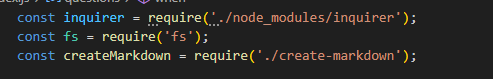
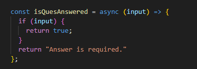

# README Generator using the Inquirer package

## Description

This application was designed to create a professional README file for a gitHub repository.. I chose this project because every good repository/project needs a professional README file..
The skills used for developing this application include node.js, inquirer package, screencastify and an understanding of process flow..

I chose these tools because Inquirer is a prompt based package and believe that prompt based technology is the best type of package to use to simplify the process for an end user. Node.js is a powerful command line tool that enables us to utilize the Inquirer package.  Within the Inquirer package I used the input prompt, editor prompt, confirm prompt, conditional statements and list prompt.  

I faced many challenges creating this application.  The basic technology was not an issue, but wanting to manipulate Inquirer beyond it's capabilities was an issue for me.  I had difficulties staying within scope to create a simple README file where one size fits all. I am of a strong opinion that a README should not just be a standardized list of questions answered with each creation of an application, but should enhance the end user's understanding of the application. For example, I feel strongly that a good README should always have a visual description for readers who conceptualize better via visual representation.  On the other hand, I used an editor prompt for the why and challenges section of the project because the communication of these is critical to the reader to assess whether this project correlates to what they are looking for.  Although using Inquirer assisted in the creation of a README, I felt I was somewhat limited with the resulting diversity in the outcome of my README.  This is a purely personal opinion and not a criticism of any package.
  

## Table of Contents

1. [Installation](#Installation)
2. [Features](#Features)
3. [Usage](#Usage)
4. [Visual Description](#Visual-Description)
5. [Contributors](#Contributing)
6. [Tests](#Tests)  
7. [Questions](#Questions)
8. [License](#License)
  

## Installation 

A user installs this application by:
	1. Cloning the Inquirer-README-Generatpr
	2. Installing Node.js
	3. Installing Inqirer.js 

  

## Features 

simple question prompts, editor prompts to enable paragraph style input and automated README generation. 
  

## Usage 

This application is intended to be used by an end user to create a professional README file.  By prompting the user to answer questions, the end user is ensured to produce all the necessary elements of a good README file.  The user is expected to answer questions, then the questions are used by the create README file and a README is created in the repository.
  

## Visual Description 

A visual representation of the working application can be seen here:  

Required package inclusion  

Conditional statement example  
  

undefined  
  

## Contributors 

Other users can create a branch, commit their changes and create a pull request to be reviewed.
  

## Tests 

The best test for this application is to run it in the command prompt by typing node index.js
  

## Questions  

Questions can be directed to maureen.business@gmail.com or submitted via my Github account at undefined .
  

## License 

[MIT](https://opensource.org/licenses/MIT)
